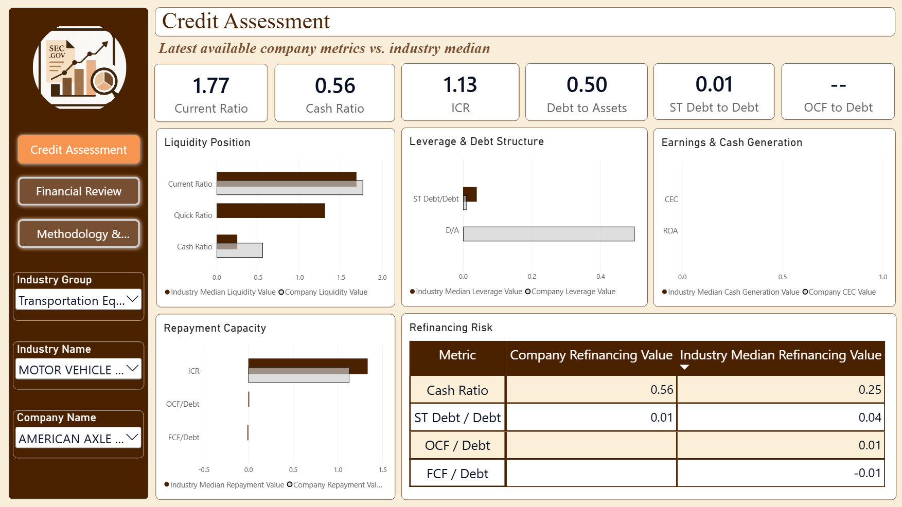
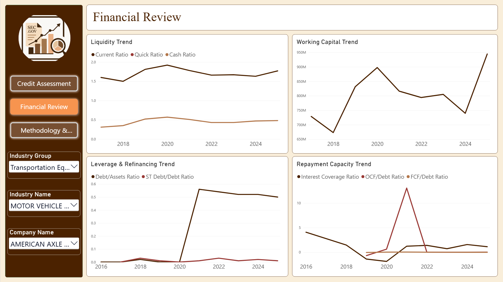
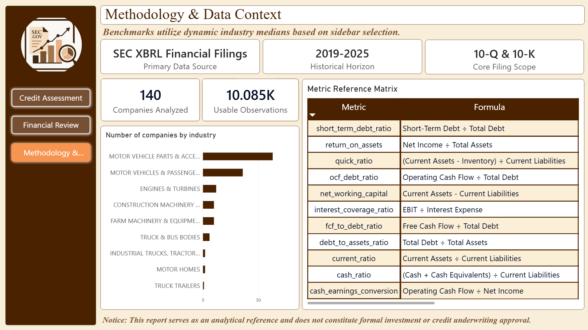

# SEC Credit-Risk Financial Health

> **A company-level financial-health analytics project built from SEC Financial Statement Data Sets, focused on supporting credit-risk analysis across an automotive and heavy-industrial manufacturing population.**

---

## 1. Executive Summary & Core Use Cases

This project uses the **SEC Financial Statement Data Sets** to build an analysis-ready financial-health dataset for a **Credit Risk Analyst** evaluating individual companies.

The project covers:

| Scope | Definition |
|---|---|
| **Companies** | ~140 |
| **Industry population** | 9 SIC-defined manufacturing industries |
| **Period** | 2019–2025 |
| **Core filings** | 10-K and 10-Q |
| **Gold observations** | 10,085 usable filing-period observations |
| **Gold metrics** | 11 |
| **Primary subject** | Individual company / filing-period observation |
| **Primary audience** | Credit Risk Analyst |

The selected population combines:

- **Automotive Core & Supply Chain**
  - 3711 — Motor Vehicles & Passenger Car Bodies
  - 3713 — Truck & Bus Bodies
  - 3714 — Motor Vehicle Parts & Accessories
  - 3715 — Truck Trailers
  - 3716 — Motor Homes
- **Heavy Industrial & Capital Equipment**
  - 3510 — Engines & Turbines
  - 3523 — Farm Machinery & Equipment
  - 3531 — Construction Machinery & Equipment
  - 3537 — Industrial Trucks, Tractors, Trailers & Stackers

The project is not intended to produce an automated lending decision or a predictive default model. It focuses on building a transparent financial-health view that can support recurring credit-risk decisions.

### Core Decision Contexts

| Decision | Question |
|---|---|
| **New Credit Facility Underwriting** | Does the borrower's current financial condition support additional credit exposure? |
| **Annual Credit-Line Renewal** | Has financial resilience materially changed since the previous review? |
| **Financial Health / Peer Positioning** | How strong or weak is the company relative to its own history and appropriate peers? |
| **Early-Warning / Watchlist Monitoring** | Are there persistent deterioration or divergence signals requiring attention? |

These decisions are evaluated through a common financial-risk framework rather than through four separate sets of metrics.

### Analytical Focus

The financial-health assessment is built around:

- Liquidity
- Repayment capacity
- Leverage
- Refinancing exposure
- Cash generation
- Profitability context
- Financial trends
- SIC-relative peer positioning
- Potential deterioration and warning signals

The objective is to move from:

```text
SEC reported financial facts
        ↓
validated financial metrics
        ↓
financial condition
        ↓
trends + peer context + warning signals
        ↓
credit-risk analysis
```

<!-- :contentReference[oaicite:0]{index=0} -->

---

## 2. Tech Stack & Reusable Data Architecture

### Tech Stack

| Technology | Role |
|---|---|
| **SEC Financial Statement Data Sets** | Primary source of financial filing data |
| **Python / Pandas** | Data extraction, processing and investigation |
| **DuckDB** | Local analytical database and consolidated storage |
| **SQL** | Data transformation, metric engineering and analytical investigation |
| **Parquet** | Efficient analytical data storage |
| **Power BI** | Interactive dashboard and presentation layer |
| **DAX** | Dashboard-level analytical measures |

The technical stack was chosen to support the analysis rather than to demonstrate enterprise data infrastructure.

The project deliberately does **not** aim to showcase technologies such as Snowflake, Spark, dbt or enterprise ELT architecture. The architecture remains lightweight so that the focus stays on analytical reasoning, data quality, financial metric construction and communication.

### Reusable Data Architecture

```text
SEC Financial Statement Data Sets
                │
                ▼
        Selective Extraction
                │
                ▼
          Source Layer
                │
                ▼
        Silver / Clean Layer
                │
                ▼
     Gold / Financial Metrics
                │
                ▼
       SQL + Python + EDA
                │
                ▼
          Power BI
```

The architecture separates the major stages of the analytical workflow without unnecessarily duplicating the SEC dataset's full structure.

A key design decision was to **filter before persistence** wherever the project scope allowed it. Instead of storing the entire SEC universe and filtering it later, the extraction process uses the finalized industry and filing scope to retain the relevant data.

The extraction process is designed around the quarterly SEC releases:

```text
Quarterly SEC release
        │
        ├── SUB
        │    ├── finalized SIC population
        │    └── 10-K / 10-Q
        │
        ▼
   Filtered filing population
        │
        ├───────────────┐
        ▼               ▼
       NUM             CAL
        │               │
        ├── DIM         │
        │               │
        └── TAG ────────┘
                │
                ▼
       Consolidated DuckDB
```

Only the data required to support the project's analytical objectives is carried forward into the later stages.

<!-- :contentReference[oaicite:1]{index=1} -->
<!-- :contentReference[oaicite:2]{index=2} -->

---

## 3. The Data Pipeline Engineering Lifecycle

The project evolved into a workflow where each stage answers a different question.

```text
Understand
    ↓
Define
    ↓
Build
    ↓
Question
    ↓
Validate
    ↓
Correct
    ↓
Analyze
    ↓
Communicate
```

### Understand

Understand what the SEC data actually represents before using it.

This included:

- Understanding the SEC Financial Statement Data Sets
- Understanding the eight core tables and their grains
- Understanding how `SUB`, `NUM`, `TAG`, `DIM`, `CAL`, `PRE`, `REN` and `TXT` relate
- Understanding the difference between reported facts and derived metrics
- Understanding the limitations of the source data

A key mental model was:

```text
SUB
Which filing?

    ↓

NUM
What value was reported?

    ↓

TAG
What does that value represent?
```

The project also established that the SEC data is largely preserved **as filed**, meaning analytical logic cannot simply assume that similarly named facts are always reported identically across companies.

<!-- :contentReference[oaicite:3]{index=3} -->
<!-- :contentReference[oaicite:4]{index=4} -->

### Define

The project moved from understanding the available data to defining what it should actually be used for.

This resulted in:

- Credit Risk Analyst as the target audience
- Individual company as the primary analytical subject
- A finalized nine-SIC manufacturing population
- 2019–2025 analytical period
- 10-K and 10-Q filing scope
- Four recurring credit-risk decision contexts
- A focused financial-risk metric spine

The important shift was:

```text
Business decision
        ↓
Analytical objective
        ↓
Required information
        ↓
Relevant SEC data
```

rather than:

```text
Available data
        ↓
Interesting metric
        ↓
Find a use for it
```

<!-- :contentReference[oaicite:5]{index=5} -->

### Build

The required SEC data was selectively extracted and consolidated into DuckDB.

The pipeline preserves the source data needed for lineage and validation while creating cleaned and analytical layers for downstream work.

The Gold layer was then constructed specifically around the project's financial-health objectives.

### Question

The project does not treat EDA or SQL as isolated technical exercises.

The analytical questions are tied back to the credit decisions:

- Can the company meet near-term obligations?
- Can it generate sufficient cash relative to its debt burden?
- How leveraged is it?
- Is financial capacity improving or deteriorating?
- Is working capital becoming a greater drain on cash?
- Is profitability supported by operating cash generation?
- How does the company compare with appropriate peers?
- Are there persistent deterioration or divergence signals?

<!-- :contentReference[oaicite:6]{index=6} -->

### Validate

The engineered metrics are treated as analytical objects that need to be tested before being used for decision-support.

Validation included:

- Population and coverage checks
- Metric distributions
- Missingness
- Extreme-value investigation
- Source-level validation
- Calculation-logic checks
- Pearson and Spearman relationships
- Financially motivated relationship analysis

### Correct

EDA identified an important calculation issue involving negative financial values.

A negative numerator divided by a negative denominator can produce a large positive ratio even when the underlying financial condition is adverse.

The ratio calculations were therefore reconstructed to preserve the intended financial sign behavior while retaining zero-denominator protection.

This was not treated as merely a statistical anomaly. The underlying SEC values were traced back to the source data before changing the metric logic.

<!-- :contentReference[oaicite:7]{index=7} -->

### Analyze

Once the metric behavior was validated, the project moved into decision-oriented analysis:

- Financial trends
- Company-level financial condition
- Peer-relative positioning
- Persistent deterioration
- Earnings/cash-flow divergence
- Relationships between financial-health dimensions

### Communicate

Power BI acts as the presentation layer for findings established through the underlying data and analysis.

The dashboard is intended to help move from:

```text
Company looks weaker
        ↓
Which dimension?
        ↓
Which metric?
        ↓
When did it change?
        ↓
How unusual is it?
        ↓
Does it warrant further review?
```

---

## 4. Silver Standardizations

The Silver layer exists to turn the selectively extracted SEC data into a cleaner and more consistent analytical foundation without prematurely collapsing the source structure.

### Standardization Principles

#### Data types are based on meaning

A value that looks numeric is not automatically treated as a measure.

Identifiers such as:

- `adsh`
- `cik`
- `dimh`
- `tag`
- `version`

remain identifier/string fields because their characters represent identity rather than quantities.

Conversely, fields representing dates, counts or financial values are standardized according to their actual semantic meaning.

> **Data type is determined by what a field represents, not simply by how its values look.**

<!-- :contentReference[oaicite:8]{index=8} -->

#### Dates and reporting fields

Relevant filing and reporting-period fields are standardized so that they can be used consistently for:

- Period filtering
- Filing chronology
- Annual and quarterly analysis
- Trend calculations
- Company history

#### Analytical population

The cleaning process preserves the finalized analytical scope:

- Nine SIC industries
- 2019–2025
- 10-K and 10-Q filings

#### Identifiers and relationships

The filing and company identifiers required to connect the SEC tables are preserved.

In particular, `adsh` remains central to connecting filing context from `SUB` with reported facts in `NUM`.

#### Missing values

Missingness is not automatically treated as bad data.

For important fields, the project distinguishes between:

- Expected missingness
- Optional source information
- Data unavailable for a particular filing
- Information genuinely required for an analytical objective

High null percentages therefore trigger investigation rather than automatic deletion.

#### Validation

Before moving analytical data forward, the cleaned layer is checked against the source using:

- Row counts
- Company counts
- Filing counts
- Null rates
- Value distributions

This helps ensure that cleaning changes the representation without silently changing the intended population.

<!-- :contentReference[oaicite:9]{index=9} -->

---

## 5. Gold Layer: Metric Spine

The final analytical table is:

```text
gold.financial_metrics
```

### Grain

> **One `adsh` + one `period_end` observation with the available financial metrics.**

Rows where all metrics were NULL were removed, leaving:

> **10,085 usable filing-period observations**

The Gold layer contains **11 financial metrics**, deliberately kept as a focused financial-risk spine rather than an attempt to create dozens of ratios.

<!-- :contentReference[oaicite:10]{index=10} -->

### Metric Spine

| Dimension | Metric | Analytical Role |
|---|---|---|
| **Liquidity** | `current_ratio` | Broad short-term liquidity coverage |
| **Liquidity** | `quick_ratio` | More liquid short-term coverage |
| **Liquidity** | `cash_ratio` | Immediate liquidity |
| **Repayment Capacity** | `interest_coverage_ratio` | Earnings capacity relative to interest burden |
| **Repayment Capacity** | `ocf_debt_ratio` | Operating cash generation relative to debt |
| **Leverage** | `debt_to_assets_ratio` | Structural debt burden |
| **Refinancing** | `short_term_debt_ratio` | Near-term debt / refinancing exposure |
| **Cash Generation** | `cash_earnings_conversion` | Earnings-to-operating-cash conversion |
| **Cash Generation** | `fcf_to_debt_ratio` | Post-capex cash generation relative to debt |
| **Liquidity Context** | `net_working_capital` | Absolute working-capital cushion |
| **Profitability Context** | `return_on_assets` | Profitability / asset productivity |

This gives the project:

> **9 primary indicators + 2 contextual indicators**

rather than treating every possible financial ratio as equally important.

<!-- :contentReference[oaicite:11]{index=11} -->

### How the metrics work together

#### Liquidity

```text
Current Ratio
Quick Ratio
Cash Ratio
       +
      NWC
```

These provide progressively stricter views of short-term liquidity while NWC provides an absolute working-capital context.

#### Repayment Capacity

```text
Interest Coverage
        +
OCF / Debt
        +
FCF / Debt
```

These provide earnings-based, operating-cash-based and post-capex views of debt capacity.

#### Leverage

```text
Debt / Assets
       +
Repayment Capacity
```

Debt burden is interpreted alongside the company's ability to service and generate cash against that burden.

#### Refinancing Exposure

```text
Short-Term Debt / Debt
        +
Liquidity
        +
Cash Generation
```

The short-term debt ratio is treated as an exposure indicator rather than a complete maturity-wall analysis.

#### Cash Generation Quality

```text
Net Income
    ↓
OCF / Net Income
    ↓
OCF / Debt
    ↓
FCF / Debt
```

This allows the analysis to distinguish profitability from the actual conversion of earnings into operating cash and cash available relative to debt.

<!-- :contentReference[oaicite:12]{index=12} -->

---

## 6. Major Technical Hurdles & Triumphs (EDA Insights)

The EDA phase was not treated as a collection of charts.

Its purpose was to establish whether the Gold metrics were sufficiently complete, interpretable, economically coherent and reliable for downstream credit-risk analysis.

### 1. Understanding the Analytical Population

The first step was establishing exactly what the Gold table represented:

- Companies
- SIC composition
- Filing types
- Reporting periods
- Observation count
- Metric coverage

This prevented later analysis from being interpreted without knowing what population it actually represented.

### 2. Metric Distribution Behavior

Financial ratios were investigated using distributions and robust summaries.

The analysis did not assume that means and standard deviations were appropriate for every financial ratio because several metrics are naturally skewed and can contain extreme observations.

The central 98% of observations was used where appropriate for visualization so that population behavior could be seen more clearly.

This was a visualization choice, **not deletion of the remaining observations**.

### 3. Outliers Were Investigated, Not Automatically Removed

Extreme values were traced back to the underlying SEC observations.

The investigation asked:

```text
Extreme value
     ↓
Source financial facts
     ↓
Is the value real?
     ↓
Calculation issue?
     ↓
Legitimate financial extreme?
```

This helped distinguish between:

- Genuine financial extremes
- Calculation problems
- Denominator-driven behavior
- Legitimate but unusual company conditions

### 4. Negative-Value Ratio Problem

One of the most important findings came from validating extreme Interest Coverage observations.

Legitimate negative financial values can cause:

```text
Negative numerator
        ÷
Negative denominator
        =
Large positive ratio
```

Mathematically, the calculation is valid.

Financially, the interpretation can be misleading.

The metric logic was therefore reconstructed so that the intended financial sign behavior was preserved rather than allowing mathematical sign cancellation to produce misleading positive ratios.

The revised calculations were then rechecked through distributional and relationship analysis.

<!-- :contentReference[oaicite:13]{index=13} -->

### 5. Bivariate Validation

Relationships between metrics were investigated using:

- Scatter plots
- Pearson correlation
- Spearman correlation

The purpose was not to force every metric to correlate strongly.

Instead, the analysis asked whether relationships behaved reasonably given the financial concepts represented by the metrics.

Examples of relationship families included:

| Relationship | Purpose |
|---|---|
| Current Ratio ↔ Quick Ratio ↔ Cash Ratio | Liquidity hierarchy and redundancy |
| Debt/Assets ↔ ICR / OCF-Debt / FCF-Debt | Debt burden vs repayment capacity |
| ICR ↔ OCF-Debt ↔ FCF-Debt | Earnings vs cash repayment consistency |
| ROA ↔ Cash Earnings Conversion / OCF-Debt / FCF-Debt | Profitability vs cash generation |
| Short-Term Debt Ratio ↔ Cash Ratio / OCF-Debt / FCF-Debt | Refinancing exposure vs capacity |
| Liquidity ratios ↔ NWC | Relative liquidity vs absolute working-capital cushion |

Weak correlation was interpreted as a weak relationship, not automatically as evidence that a calculation was wrong.

<!-- :contentReference[oaicite:14]{index=14} -->

### 6. Analytical Boundaries Established by EDA

The EDA phase also established several interpretation boundaries:

- Ratios can be sensitive to small or near-zero denominators.
- Metric coverage varies.
- Repeated filing-period observations are not equivalent to a sample of independent companies.
- Correlation indicates association, not causation.
- SIC provides a useful grouping mechanism but does not guarantee perfect economic peer comparability.
- Legitimate extreme observations should remain available for investigation.
- EDA validates metric coherence and analytical readiness; it does not establish predictive default performance.

### EDA Outcome

The Gold metric spine was considered sufficiently validated to move into:

```text
Decision-oriented SQL
        ↓
Financial analysis
        ↓
Power BI dashboard
```

The next question therefore changed from:

> **"Can these metrics be trusted?"**

to:

> **"What do these metrics tell us about the credit decisions the project was built to support?"**

<!-- :contentReference[oaicite:15]{index=15} -->

---

## 7. Dashboard Interface & Analytical Scope

Power BI is the **presentation layer**, bringing the validated financial metrics into a company-level credit-risk review.

The report is structured around three pages, each answering a different part of the assessment.

### Credit Assessment



**Question:**

> How does the company's latest available financial position compare with the industry benchmark?

The **Credit Assessment** page provides the current snapshot of the selected company against the **industry median**, covering the main financial-risk dimensions:

- **Liquidity Position** — Current Ratio, Quick Ratio and Cash Ratio
- **Leverage & Debt Structure** — Debt/Assets and Short-Term Debt/Debt
- **Earnings & Cash Generation** — Cash Earnings Conversion and ROA
- **Repayment Capacity** — Interest Coverage, OCF/Debt and FCF/Debt
- **Refinancing Risk** — Cash Ratio, ST Debt/Debt, OCF/Debt and FCF/Debt

This page is intended to answer questions such as:

- Is the company's liquidity position stronger or weaker than the industry benchmark?
- Is the company carrying a relatively higher debt burden?
- Does its debt structure indicate greater short-term refinancing exposure?
- How well do earnings and operating cash generation support its debt?
- Are repayment-capacity metrics consistent with the company's overall financial position?
- Does the current financial position indicate areas that require closer review?

The industry benchmark is dynamically determined from the selected industry context rather than using a single benchmark for the entire nine-industry population.

### Financial Trend & Renewal



**Question:**

> How has the company's financial condition changed over its available history?

The **Financial Review** page shifts the analysis from the latest snapshot to the company's historical direction.

It examines four major areas:

- **Liquidity Trend** — Current Ratio, Quick Ratio and Cash Ratio
- **Working Capital Trend** — Net Working Capital
- **Leverage & Refinancing Trend** — Debt/Assets and Short-Term Debt/Debt
- **Repayment Capacity Trend** — Interest Coverage, OCF/Debt and FCF/Debt

This allows questions such as:

- Has liquidity been improving or deteriorating over time?
- Has the company's working-capital cushion remained stable?
- Has leverage increased or decreased?
- Has short-term debt exposure changed materially?
- Has repayment capacity weakened or strengthened?
- Are changes persistent, or are they isolated movements?

The purpose is to provide historical context for a financial review or credit-line renewal rather than relying only on the latest reported values.

### Methodology & Data Context



**Question:**

> What data, population and metric definitions sit behind the analysis?

The **Methodology & Data Context** page provides the context required to interpret the dashboard without treating the displayed metrics as standalone numbers.

It communicates:

- Primary SEC data source
- 2019–2025 historical horizon
- 10-Q and 10-K filing scope
- Companies and usable observations covered
- Industry population
- Financial metric definitions and formulas
- Analytical limitations and methodology notes

The page also provides the industry composition so that the scope of the peer benchmark is visible rather than hidden behind the dashboard calculations.

### Dashboard Validation: Latest-Value Problem

During dashboard development, a modeling issue was identified around the concept of the "latest value."

The Gold grain is:

```text
adsh + period_end
```

A single period end can therefore have multiple non-null observations for a metric because of different filing/reporting contexts.

Simply selecting one arbitrary observation as the "latest value" would therefore introduce an unjustified assumption.

The dashboard logic was changed to use the **median of available metric values at the latest period end** rather than arbitrarily selecting one observation.

This was an important example of the dashboard exposing an underlying analytical assumption that needed to be resolved rather than hidden.

<!-- :contentReference[oaicite:16]{index=16} -->

---

## 8. Post-Mortem & Strategic Lessons Learned

### The project started with the data

The project initially began from:

> **"I have this interesting SEC dataset. What can I build with it?"**

rather than from a clearly defined business problem.

That created a significant amount of early exploration around what the dataset could support.

The eventual correction was to establish:

```text
Audience
    ↓
Business problem
    ↓
Decision contexts
    ↓
Analytical questions
    ↓
Required metrics
    ↓
Required SEC data
```

This became a much stronger basis for the rest of the project.

### Understanding the data was analytical work

The SEC dataset contains multiple tables with different grains, relationships and meanings.

Understanding those structures was not simply a technical prerequisite. It determined what could safely be interpreted and how financial concepts could be reconstructed from the reported facts.

The project therefore treated the source schema as something to understand before treating it as a generic database.

### Scope was necessary

The SEC dataset is much broader than what this project needed.

Narrowing the population to nine SIC-defined manufacturing industries and a defined historical period made the analysis manageable while keeping the population relevant to the selected credit-risk context.

### Metric engineering was not just formula writing

A formula can be mathematically correct while still producing a financially misleading result.

The negative-value ratio issue demonstrated this directly.

The resulting lesson was:

> **A financial metric needs both mathematical validation and financial-behavior validation.**

### Outliers became investigation points

The project did not adopt the simple rule:

> "Extreme value = bad data."

Instead:

```text
Extreme
   ↓
Investigate
   ↓
Trace to source
   ↓
Understand cause
   ↓
Decide treatment
```

This produced a more defensible analytical workflow.

### Statistical analysis was used for validation

Pearson and Spearman correlations were not added simply because they are common statistical techniques.

They were used to investigate whether engineered metrics behaved consistently with the financial concepts they were intended to represent.

The broader principle became:

> **Question first → statistical method second.**

### The dashboard exposed a modeling assumption

The latest-value issue showed that analytical modeling does not necessarily end when the Gold table is created.

A dashboard calculation can reveal an assumption that was not obvious at the table-building stage.

In this case:

```text
"Latest value"
        ↓
Multiple valid observations
        ↓
Arbitrary selection would be unjustified
        ↓
Use latest-period median
```

The correction preserved analytical integrity rather than forcing the data into a simpler but unsupported representation.

### The case-study approach

The project also uses company financial reports as practical case studies to demonstrate how the analytical framework can be applied to an individual company.

The case-study approach follows the report itself rather than pretending to provide an expert credit opinion:

1. Review the first page and identify important financial information, visuals and signals.
2. Form questions that require further investigation.
3. Review the second page and the broader financial trends.
4. Interpret what those trends appear to indicate.
5. Connect the observations back to the financial-health dimensions used in the project.
6. State a cautious overall view or area for further investigation.

The purpose is to demonstrate the transition from:

```text
Financial report
      ↓
Observation
      ↓
Question
      ↓
Investigation
      ↓
Interpretation
```

rather than presenting a beginner data-analyst project as if it were a professional credit opinion.

### Final Lesson

The most important lesson from the project was that building a useful analytical product is not simply:

```text
Get data
   ↓
Clean data
   ↓
Make charts
```

It is closer to:

```text
Understand
   ↓
Define
   ↓
Build
   ↓
Question
   ↓
Validate
   ↓
Correct
   ↓
Analyze
   ↓
Communicate
```

The technical components — Python, DuckDB, SQL, financial metric engineering, EDA, statistics and Power BI — are useful because they support that process.

The final product is therefore not just an SEC dataset or a financial dashboard. It is a **decision-oriented analytical workflow for examining company financial health within a defined credit-risk context**.

<!-- :contentReference[oaicite:17]{index=17} -->
<!-- :contentReference[oaicite:18]{index=18} -->
<!-- :contentReference[oaicite:19]{index=19} -->
